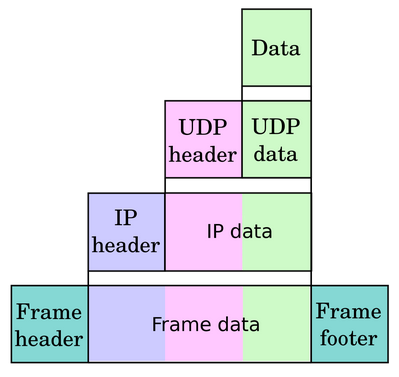

# Talking HTTP 

## www :
- `www`(world wide web) is collection of websites or web-pages stores in web servers and connected to local computers through internet.

## Static HTTP vs Dynamic HTTP :

* Static HTTP : Static HTTP mean once our browser request something it download into the the browser and display it.
* Dynamic HTTP : Dynamic HTTP mean The real time interaction with web, suppose we watch some videos then our browser will download & render it and show us in real time, or we fetch the time from internet and it increment at every second by real time interaction.  
  

```js
// static Request :
HTTP /cat.gif HTTP/1.0 
// static Response :
HTTP /1.0 200 OK
----------------------------------------
// Dynamic Request :
GET /time?tz=UTC HTTP/1.0
// Dynamic Response :
HTTP/1.0 200 OK
Content-Type: text/plain
Content-length: 19

2023-02-19 10:22:23 
```

## Internet :
* Internet is backbone for www, in order for the www work it need some sort of system or way of transmitting data from one system to another, and the way that work is internet.
* Internet is a way to transmitting data from one device to another, to possible this we need inter-connection between every devices and this will be possible with Internet.
* To Communicate b/w two devices we can use any wire or wireless device and connect both devices then we can send any message into the network. but what if we have to communicate b/w two devices without wires or wireless medium. Here Internet comes, Internet is Distributed system of machine, may be we are not directly connected with our destination device but we are connected with those device that connected with our destination device, then in this case we can use the another device as a way to send any message to our destination devices. 
* We can say internet is `Network of Networks`.

## Abstraction of Network :
* Network is an abstraction of layers.
> TCP/IP Flow

 
* **link layer** : link layer is bottom layer or we can say the physical connected layer, every device that comes into internet is connected with some sort of wire or wireless medium that comes under the link layer.

* **Internet Layer** : This layer responsible for finding the right computer on the network. Consist of - IP, ICMP, ARP etc.   

* **Transport Layer** : This layer responsible for the rules and protocols that find the right program. consist of - TCP, UDP etc.

* **Application Layer** : This layer deals with how we are going to talk with our programs. consist of HTTP, SSH, FTP etc.

## RFC-1945 :
* RFC-1945 Request for comments that defines `HTTP : hyper text transfer protocol` .
* The Hypertext Transfer Protocol (HTTP) is an application-level    protocol with the lightness and speed necessary for distributed,    collaborative, hypermedia information systems. It is a generic,    stateless, object-oriented protocol which can be used for many tasks,    such as name servers and distributed object management systems,    through extension of its request methods (commands). A feature of    HTTP is the typing of data representation, allowing systems to be    built independently of the data being transferred.


## HTTP URL Scheme :

```plain
<scheme>://<host>:<port>/<path>?<query>#<fragment>
```

* Scheme : protocol used to access the resource.
* Host : Host that hold the resource.
* Port : Port for program servicing  resource.
* Path : Path is directory that holds in the resource in the web page.
* Query : Information that resource can use.
* Fragement : Client information about the resource.

## Parameters of HTTP Request : 

* While requesting to http we use diffent parameters to request any web-page.
* Let's take an example of simple GET Request :

```plain
GET /any_directory HTTP/1.1
Host: 127.0.0.1
Connection: keep-alive
Cookie: cookie=1edf04ac5e3cd34b9716ceac6b943a28
User-Agent: curl/7.2
```
* The first line is use `GET` method of HTTP verb, then we have the directory loaction `/` then the http version that we use for the communication `HTTP/1.1` 
* Second,third line has `Host` & `connection` header.
* Forth line has `cookie` header.
* Last line has user agent header in this i use curl so the it uses curl/7.2.


## Curl : 
* Curl is used for transfer data from or to a server.

```sh
# Make a req using curl.

$ curl http://hostname -v -i 

# This wiill make a request on hostname and show the details output 

$ curl --help all

# this will give all the switch details which is used in curl.

$ man curl 

# this will open the manual page of curl.

$ curl http://hostname -A "sahilwep" -H "Host: 127.0.0.1"

# -A will use for user-agent header, -H is used for custom header.

$ curl http://hostname --cookie-jar filename.txt

# while intracting with stateful page use  --cookie-jar  header...

$ curl --help all

# explore more....
```


## Nc (Netcat) : 

* Nc is used to read and write data from across the network.

```sh
$ cat req.txt
GET / HTTP/1.1
Host: 127.0.0.1

$ cat req.txt  | nc localhost 80 -v
Connection to localhost 80 port [tcp/http] succeeded!
HTTP/1.1 200 OK
Server: Werkzeug/2.2.3 Python/3.8.10
Date: Fri, 24 Feb 2023 17:04:28 GMT
Content-Length: 57
Server: pwn.college
Connection: close
```

* Use `man nc` to get the manual page of nc. 

## Python Request : 

* Python has module name as `requests` which is used to intract with HTTP network.
* [requests](https://requests.readthedocs.io/en/latest/)

> Example : 

```py
import requests as re

url = 'http://hackycorp.com/'
response = re.get(url)

print(response.text)
print(response.status_code)
print(response.url)
```

* Frist i import request module as re, which is sort name.
* Then i declare a variable that store the get request..
* I pass the url into the get request.
* Then i print the output text, status_code, and the url..